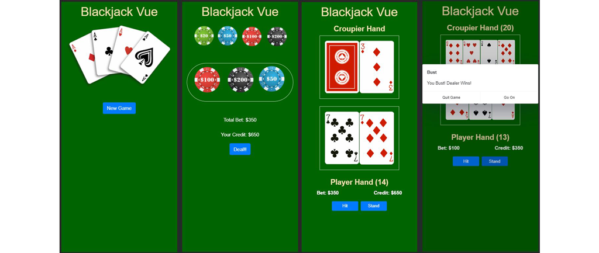

# Blackjack Vue :spades: :hearts: :clubs: :diamonds:

## :rocket: Play Now
(https://semihsemih.github.io/Blackjack-Vue/)



## Introduction

Blackjack Vue is a single-player HTML5 blackjack game built with [vue](https://vuejs.org/).

## Project setup
```
npm install
```

### Compiles and hot-reloads for development
```
npm run serve
```

### Compiles and minifies for production
```
npm run build
```

### Lints and fixes files
```
npm run lint
```

### Customize configuration
See [Configuration Reference](https://cli.vuejs.org/config/).
